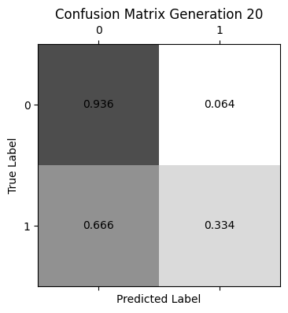

# Model Collapse Images & Graphs

## Correlation Matrix Tables

### QUALITY:
                      fixed_acidity  volatile_acidity  citric_acid  \
fixed_acidity              1.000000          0.219008     0.324436   
volatile_acidity           0.219008          1.000000    -0.377981   
citric_acid                0.324436         -0.377981     1.000000   
residual_sugar            -0.111981         -0.196011     0.142451   
chlorides                  0.298195          0.377124     0.038998   
free_sulfur_dioxide       -0.282735         -0.352557     0.133126   
total_sulfur_dioxide      -0.329054         -0.414476     0.195242   
density                    0.458910          0.271296     0.096154   
pH                        -0.252700          0.261454    -0.329808   
sulphates                  0.299568          0.225984     0.056197   
alcohol                   -0.095452         -0.037640    -0.010493   
quality                   -0.076743         -0.265699     0.085532   
color                     -0.486740         -0.653036     0.187397   

                      residual_sugar  chlorides  free_sulfur_dioxide  \
fixed_acidity              -0.111981   0.298195            -0.282735   
volatile_acidity           -0.196011   0.377124            -0.352557   
citric_acid                 0.142451   0.038998             0.133126   
residual_sugar              1.000000  -0.128940             0.402871   
chlorides                  -0.128940   1.000000            -0.195045   
free_sulfur_dioxide         0.402871  -0.195045             1.000000   
total_sulfur_dioxide        0.495482  -0.279630             0.720934   
density                     0.552517   0.362615             0.025717   
pH                         -0.267320   0.044708            -0.145854   
sulphates                  -0.185927   0.395593            -0.188457   
alcohol                    -0.359415  -0.256916            -0.179838   
quality                    -0.036980  -0.200666             0.055463   
color                       0.348821  -0.512678             0.471644   

                      total_sulfur_dioxide   density        pH  sulphates  \
fixed_acidity                    -0.329054  0.458910 -0.252700   0.299568   
volatile_acidity                 -0.414476  0.271296  0.261454   0.225984   
citric_acid                       0.195242  0.096154 -0.329808   0.056197   
residual_sugar                    0.495482  0.552517 -0.267320  -0.185927   
chlorides                        -0.279630  0.362615  0.044708   0.395593   
free_sulfur_dioxide               0.720934  0.025717 -0.145854  -0.188457   
total_sulfur_dioxide              1.000000  0.032395 -0.238413  -0.275727   
density                           0.032395  1.000000  0.011686   0.259478   
pH                               -0.238413  0.011686  1.000000   0.192123   
sulphates                        -0.275727  0.259478  0.192123   1.000000   
alcohol                          -0.265740 -0.686745  0.121248  -0.003029   
quality                          -0.041385 -0.305858  0.019506   0.038485   
color                             0.700357 -0.390645 -0.329129  -0.487218   

                       alcohol   quality     color  
fixed_acidity        -0.095452 -0.076743 -0.486740  
volatile_acidity     -0.037640 -0.265699 -0.653036  
citric_acid          -0.010493  0.085532  0.187397  
residual_sugar       -0.359415 -0.036980  0.348821  
chlorides            -0.256916 -0.200666 -0.512678  
free_sulfur_dioxide  -0.179838  0.055463  0.471644  
total_sulfur_dioxide -0.265740 -0.041385  0.700357  
density              -0.686745 -0.305858 -0.390645  
pH                    0.121248  0.019506 -0.329129  
sulphates            -0.003029  0.038485 -0.487218  
alcohol               1.000000  0.444319  0.032970  
quality               0.444319  1.000000  0.119323  
color                 0.032970  0.119323  1.000000  

### COLOR:

### DEFAULT:
           LIMIT_BAL       SEX  EDUCATION  MARRIAGE       AGE     PAY_1  \
LIMIT_BAL   1.000000  0.024755  -0.219161 -0.108139  0.144713 -0.271214   
SEX         0.024755  1.000000   0.014232 -0.031389 -0.090874 -0.057643   
EDUCATION  -0.219161  0.014232   1.000000 -0.143464  0.175061  0.105364   
MARRIAGE   -0.108139 -0.031389  -0.143464  1.000000 -0.414170  0.019917   
AGE         0.144713 -0.090874   0.175061 -0.414170  1.000000 -0.039447   
PAY_1      -0.271214 -0.057643   0.105364  0.019917 -0.039447  1.000000   
PAY_2      -0.296382 -0.070771   0.121566  0.024199 -0.050148  0.672164   
PAY_3      -0.286123 -0.066096   0.114025  0.032688 -0.053048  0.574245   
PAY_4      -0.267460 -0.060173   0.108793  0.033122 -0.049722  0.538841   
PAY_5      -0.249411 -0.055064   0.097520  0.035629 -0.053826  0.509426   
PAY_6      -0.235195 -0.044008   0.082316  0.034345 -0.048773  0.474553   
BILL_AMT1   0.285430 -0.033642   0.023581 -0.023472  0.056239  0.187068   
BILL_AMT2   0.278314 -0.031183   0.018749 -0.021602  0.054283  0.189859   
BILL_AMT3   0.283236 -0.024563   0.013002 -0.024909  0.053710  0.179785   
BILL_AMT4   0.293988 -0.021880  -0.000451 -0.023344  0.051353  0.179125   
BILL_AMT5   0.295562 -0.017005  -0.007567 -0.025393  0.049345  0.180635   
BILL_AMT6   0.290389 -0.016733  -0.009099 -0.021207  0.047613  0.176980   
PAY_AMT1    0.195236 -0.000242  -0.037456 -0.005979  0.026147 -0.079269   
PAY_AMT2    0.178408 -0.001391  -0.030038 -0.008093  0.021785 -0.070101   
PAY_AMT3    0.210167 -0.008597  -0.039943 -0.003541  0.029247 -0.070561   
PAY_AMT4    0.203242 -0.002229  -0.038218 -0.012659  0.021379 -0.064005   
PAY_AMT5    0.217202 -0.001667  -0.040358 -0.001205  0.022850 -0.058190   
PAY_AMT6    0.219595 -0.002766  -0.037200 -0.006641  0.019478 -0.058673   
DEFAULT    -0.153520 -0.039961   0.028006 -0.024339  0.013890  0.324794   

              PAY_2     PAY_3     PAY_4     PAY_5  ...  BILL_AMT4  BILL_AMT5  \
LIMIT_BAL -0.296382 -0.286123 -0.267460 -0.249411  ...   0.293988   0.295562   
SEX       -0.070771 -0.066096 -0.060173 -0.055064  ...  -0.021880  -0.017005   
EDUCATION  0.121566  0.114025  0.108793  0.097520  ...  -0.000451  -0.007567   
MARRIAGE   0.024199  0.032688  0.033122  0.035629  ...  -0.023344  -0.025393   
AGE       -0.050148 -0.053048 -0.049722 -0.053826  ...   0.051353   0.049345   
PAY_1      0.672164  0.574245  0.538841  0.509426  ...   0.179125   0.180635   
PAY_2      1.000000  0.766552  0.662067  0.622780  ...   0.222237   0.221348   
PAY_3      0.766552  1.000000  0.777359  0.686775  ...   0.227202   0.225145   
PAY_4      0.662067  0.777359  1.000000  0.819835  ...   0.245917   0.242902   
PAY_5      0.622780  0.686775  0.819835  1.000000  ...   0.271915   0.269783   
PAY_6      0.575501  0.632684  0.716449  0.816900  ...   0.266356   0.290894   
BILL_AMT1  0.234887  0.208473  0.202812  0.206684  ...   0.860272   0.829779   
BILL_AMT2  0.235257  0.237295  0.225816  0.226913  ...   0.892482   0.859778   
BILL_AMT3  0.224146  0.227494  0.244983  0.243335  ...   0.923969   0.883910   
BILL_AMT4  0.222237  0.227202  0.245917  0.271915  ...   1.000000   0.940134   
BILL_AMT5  0.221348  0.225145  0.242902  0.269783  ...   0.940134   1.000000   
BILL_AMT6  0.219403  0.222327  0.239154  0.262509  ...   0.900941   0.946197   
PAY_AMT1  -0.080701  0.001295 -0.009362 -0.006089  ...   0.233012   0.217031   
PAY_AMT2  -0.058990 -0.066793 -0.001944 -0.003191  ...   0.207564   0.181246   
PAY_AMT3  -0.055901 -0.053311 -0.069235  0.009062  ...   0.300023   0.252305   
PAY_AMT4  -0.046858 -0.046067 -0.043461 -0.058299  ...   0.130191   0.293118   
PAY_AMT5  -0.037093 -0.035863 -0.033590 -0.033337  ...   0.160433   0.141574   
PAY_AMT6  -0.036500 -0.035861 -0.026565 -0.023027  ...   0.177637   0.164184   
DEFAULT    0.263551  0.235253  0.216614  0.204149  ...  -0.010156  -0.006760   

           BILL_AMT6  PAY_AMT1  PAY_AMT2  PAY_AMT3  PAY_AMT4  PAY_AMT5  \
LIMIT_BAL   0.290389  0.195236  0.178408  0.210167  0.203242  0.217202   
SEX        -0.016733 -0.000242 -0.001391 -0.008597 -0.002229 -0.001667   
EDUCATION  -0.009099 -0.037456 -0.030038 -0.039943 -0.038218 -0.040358   
MARRIAGE   -0.021207 -0.005979 -0.008093 -0.003541 -0.012659 -0.001205   
AGE         0.047613  0.026147  0.021785  0.029247  0.021379  0.022850   
PAY_1       0.176980 -0.079269 -0.070101 -0.070561 -0.064005 -0.058190   
PAY_2       0.219403 -0.080701 -0.058990 -0.055901 -0.046858 -0.037093   
PAY_3       0.222327  0.001295 -0.066793 -0.053311 -0.046067 -0.035863   
PAY_4       0.239154 -0.009362 -0.001944 -0.069235 -0.043461 -0.033590   
PAY_5       0.262509 -0.006089 -0.003191  0.009062 -0.058299 -0.033337   
PAY_6       0.285091 -0.001496 -0.005223  0.005834  0.019018 -0.046434   
BILL_AMT1   0.802650  0.140277  0.099355  0.156887  0.158303  0.167026   
BILL_AMT2   0.831594  0.280365  0.100851  0.150718  0.147398  0.157957   
BILL_AMT3   0.853320  0.244335  0.316936  0.130011  0.143405  0.179712   
BILL_AMT4   0.900941  0.233012  0.207564  0.300023  0.130191  0.160433   
BILL_AMT5   0.946197  0.217031  0.181246  0.252305  0.293118  0.141574   
BILL_AMT6   1.000000  0.199965  0.172663  0.233770  0.250237  0.307729   
PAY_AMT1    0.199965  1.000000  0.285576  0.252191  0.199558  0.148459   
PAY_AMT2    0.172663  0.285576  1.000000  0.244770  0.180107  0.180908   
PAY_AMT3    0.233770  0.252191  0.244770  1.000000  0.216325  0.159214   
PAY_AMT4    0.250237  0.199558  0.180107  0.216325  1.000000  0.151830   
PAY_AMT5    0.307729  0.148459  0.180908  0.159214  0.151830  1.000000   
PAY_AMT6    0.115494  0.185735  0.157634  0.162740  0.157834  0.154896   
DEFAULT    -0.005372 -0.072929 -0.058579 -0.056250 -0.056827 -0.055124   

           PAY_AMT6   DEFAULT  
LIMIT_BAL  0.219595 -0.153520  
SEX       -0.002766 -0.039961  
EDUCATION -0.037200  0.028006  
MARRIAGE  -0.006641 -0.024339  
AGE        0.019478  0.013890  
PAY_1     -0.058673  0.324794  
PAY_2     -0.036500  0.263551  
PAY_3     -0.035861  0.235253  
PAY_4     -0.026565  0.216614  
PAY_5     -0.023027  0.204149  
PAY_6     -0.025299  0.186866  
BILL_AMT1  0.179341 -0.019644  
BILL_AMT2  0.174256 -0.014193  
BILL_AMT3  0.182326 -0.014076  
BILL_AMT4  0.177637 -0.010156  
BILL_AMT5  0.164184 -0.006760  
BILL_AMT6  0.115494 -0.005372  
PAY_AMT1   0.185735 -0.072929  
PAY_AMT2   0.157634 -0.058579  
PAY_AMT3   0.162740 -0.056250  
PAY_AMT4   0.157834 -0.056827  
PAY_AMT5   0.154896 -0.055124  
PAY_AMT6   1.000000 -0.053183  
DEFAULT   -0.053183  1.000000  

[24 rows x 24 columns]

## Correlation Matrix Graphs

### QUALITY:

### COLOR:

### DEFAULT:

## Metrics Tables

### QUALITY: 
1. 
Model Collapse Simulation Results
====================================================================================================
 Gen | Train Acc | Test Acc | Class Ent |  Feat Var | Feat Corr | Leaf Div
----------------------------------------------------------------------------------------------------
   0 |    1.0000 |   0.5975 |    1.8235 |   28.4183 |    0.2500 |   1.0021
   1 |    1.0000 |   0.5577 |    1.8248 |   30.0207 |    0.2480 |   1.0027
   2 |    1.0000 |   0.5503 |    1.8314 |   32.4561 |    0.2409 |   1.0033
   3 |    1.0000 |   0.5309 |    1.8471 |   34.1772 |    0.2470 |   1.0038
   4 |    1.0000 |   0.5263 |    1.8437 |   37.5879 |    0.2577 |   1.0045
   5 |    1.0000 |   0.5252 |    1.8181 |   34.3660 |    0.2684 |   1.0050
   6 |    1.0000 |   0.5219 |    1.8059 |   35.3004 |    0.2739 |   1.0057
   7 |    1.0000 |   0.5133 |    1.8337 |   37.9866 |    0.2737 |   1.0062
   8 |    1.0000 |   0.5190 |    1.8461 |   40.6959 |    0.2784 |   1.0068
   9 |    1.0000 |   0.5120 |    1.8737 |   37.2034 |    0.2822 |   1.0075
  10 |    1.0000 |   0.5045 |    1.8915 |   36.9953 |    0.2822 |   1.0081
  11 |    1.0000 |   0.5069 |    1.8744 |   32.8183 |    0.2778 |   1.0087
  12 |    1.0000 |   0.5008 |    1.8582 |   32.0365 |    0.2822 |   1.0092
  13 |    1.0000 |   0.4940 |    1.8405 |   30.0868 |    0.2906 |   1.0098
  14 |    1.0000 |   0.4944 |    1.8443 |   30.4710 |    0.2955 |   1.0103
  15 |    1.0000 |   0.4891 |    1.8667 |   30.6719 |    0.3009 |   1.0109
  16 |    1.0000 |   0.4946 |    1.8548 |   31.6019 |    0.2972 |   1.0116
  17 |    1.0000 |   0.4900 |    1.8858 |   33.1605 |    0.3076 |   1.0119
  18 |    1.0000 |   0.4898 |    1.8713 |   31.9859 |    0.3052 |   1.0125
  19 |    1.0000 |   0.4931 |    1.9314 |   32.5821 |    0.3035 |   1.0131
  20 |    1.0000 |   0.4847 |    1.9170 |   33.6291 |    0.3043 |   1.0132
  21 |    1.0000 |   0.4766 |    1.9509 |   32.5808 |    0.3075 |   1.0135
  22 |    1.0000 |   0.4794 |    1.9556 |   33.8150 |    0.3017 |   1.0139
  23 |    1.0000 |   0.4583 |    1.9670 |   35.7439 |    0.2999 |   1.0146
  24 |    1.0000 |   0.4713 |    1.9523 |   37.0440 |    0.3001 |   1.0150
  25 |    1.0000 |   0.4577 |    1.9588 |   37.2367 |    0.3057 |   1.0152
  26 |    1.0000 |   0.4447 |    1.9644 |   37.3544 |    0.3106 |   1.0160
  27 |    1.0000 |   0.4451 |    1.9476 |   39.4423 |    0.3095 |   1.0171
  28 |    1.0000 |   0.4513 |    1.9115 |   40.1106 |    0.3111 |   1.0178
  29 |    1.0000 |   0.4585 |    1.8598 |   40.9304 |    0.3114 |   1.0184
  30 |    1.0000 |   0.4585 |    1.8455 |   41.9076 |    0.3153 |   1.0186
  31 |    1.0000 |   0.4603 |    1.8448 |   40.3135 |    0.3147 |   1.0194
  32 |    1.0000 |   0.4616 |    1.8728 |   42.1772 |    0.3138 |   1.0203
  33 |    1.0000 |   0.4530 |    1.8895 |   40.8226 |    0.3053 |   1.0205
  34 |    1.0000 |   0.4504 |    1.8896 |   40.5420 |    0.2997 |   1.0211
  35 |    1.0000 |   0.4440 |    1.9005 |   40.9485 |    0.3039 |   1.0213
  36 |    1.0000 |   0.4460 |    1.9551 |   39.3578 |    0.2925 |   1.0218
  37 |    1.0000 |   0.4458 |    1.9403 |   40.2135 |    0.2933 |   1.0227
  38 |    1.0000 |   0.4388 |    1.8989 |   42.0828 |    0.2998 |   1.0230
  39 |    1.0000 |   0.4403 |    1.9170 |   40.5670 |    0.2921 |   1.0238
  40 |    1.0000 |   0.4449 |    1.8766 |   40.0344 |    0.2892 |   1.0240
  41 |    1.0000 |   0.4445 |    1.8806 |   38.5464 |    0.2904 |   1.0244
  42 |    1.0000 |   0.4401 |    1.8578 |   38.2059 |    0.3020 |   1.0245
  43 |    1.0000 |   0.4405 |    1.8565 |   39.7219 |    0.3082 |   1.0248
  44 |    1.0000 |   0.4350 |    1.8880 |   40.2756 |    0.3089 |   1.0249
  45 |    1.0000 |   0.4291 |    1.8684 |   37.4257 |    0.3111 |   1.0257
  46 |    1.0000 |   0.4533 |    1.8582 |   35.6072 |    0.3128 |   1.0262
  47 |    1.0000 |   0.4399 |    1.8573 |   36.4034 |    0.3185 |   1.0258
  48 |    1.0000 |   0.4438 |    1.8632 |   35.9726 |    0.3141 |   1.0277
  49 |    1.0000 |   0.4467 |    1.8414 |   35.3284 |    0.3126 |   1.0278
  50 |    1.0000 |   0.4462 |    1.8509 |   35.2396 |    0.3064 |   1.0281
  51 |    1.0000 |   0.4423 |    1.8809 |   35.9828 |    0.3037 |   1.0283
  52 |    1.0000 |   0.4427 |    1.8718 |   34.6956 |    0.3040 |   1.0284
  53 |    1.0000 |   0.4256 |    1.8637 |   33.9379 |    0.3064 |   1.0293
  54 |    1.0000 |   0.4467 |    1.8475 |   33.1820 |    0.3152 |   1.0303
  55 |    1.0000 |   0.4383 |    1.8321 |   32.2285 |    0.3111 |   1.0314
  56 |    1.0000 |   0.4271 |    1.8209 |   31.8011 |    0.3070 |   1.0322
  57 |    1.0000 |   0.4280 |    1.8212 |   30.8611 |    0.3015 |   1.0327
  58 |    1.0000 |   0.4271 |    1.8378 |   30.7799 |    0.2986 |   1.0322
  59 |    1.0000 |   0.4207 |    1.8491 |   28.4060 |    0.3067 |   1.0330
  60 |    1.0000 |   0.4174 |    1.8501 |   28.6345 |    0.3132 |   1.0336
  61 |    1.0000 |   0.4220 |    1.8337 |   30.6052 |    0.3164 |   1.0345
  62 |    1.0000 |   0.4146 |    1.8160 |   32.0317 |    0.3230 |   1.0335
  63 |    1.0000 |   0.4258 |    1.7966 |   32.2017 |    0.3236 |   1.0338
  64 |    1.0000 |   0.4284 |    1.7846 |   32.5677 |    0.3235 |   1.0338
  65 |    1.0000 |   0.4209 |    1.7898 |   33.7748 |    0.3228 |   1.0348
  66 |    1.0000 |   0.4229 |    1.7787 |   35.6961 |    0.3170 |   1.0358
  67 |    1.0000 |   0.4289 |    1.7650 |   33.8881 |    0.3193 |   1.0364
  68 |    1.0000 |   0.4335 |    1.7820 |   33.9333 |    0.3203 |   1.0366
  69 |    1.0000 |   0.4284 |    1.8016 |   34.0546 |    0.3191 |   1.0381
  70 |    1.0000 |   0.4335 |    1.7854 |   35.5671 |    0.3289 |   1.0375
  71 |    1.0000 |   0.4381 |    1.7938 |   33.9835 |    0.3288 |   1.0378
  72 |    1.0000 |   0.4264 |    1.7943 |   33.1679 |    0.3262 |   1.0384
  73 |    1.0000 |   0.4253 |    1.8040 |   33.0528 |    0.3287 |   1.0389
  74 |    1.0000 |   0.4229 |    1.7850 |   33.7103 |    0.3341 |   1.0394
  75 |    1.0000 |   0.4348 |    1.7854 |   33.2103 |    0.3323 |   1.0393
  76 |    1.0000 |   0.4456 |    1.7864 |   32.7851 |    0.3330 |   1.0416
  77 |    1.0000 |   0.4372 |    1.8087 |   32.7051 |    0.3339 |   1.0416
  78 |    1.0000 |   0.4330 |    1.7895 |   31.9056 |    0.3283 |   1.0420
  79 |    1.0000 |   0.4383 |    1.8095 |   30.3949 |    0.3239 |   1.0417
  80 |    1.0000 |   0.4451 |    1.8145 |   29.4269 |    0.3190 |   1.0423
  81 |    1.0000 |   0.4423 |    1.8130 |   29.3038 |    0.3228 |   1.0419
  82 |    1.0000 |   0.4330 |    1.8206 |   27.8938 |    0.3256 |   1.0450
  83 |    1.0000 |   0.4357 |    1.8194 |   28.1109 |    0.3237 |   1.0435
  84 |    1.0000 |   0.4264 |    1.8344 |   26.9986 |    0.3310 |   1.0446
  85 |    1.0000 |   0.4379 |    1.8330 |   27.4688 |    0.3354 |   1.0456
  86 |    1.0000 |   0.4379 |    1.8397 |   27.9977 |    0.3403 |   1.0454
  87 |    1.0000 |   0.4394 |    1.8348 |   26.8242 |    0.3412 |   1.0487
  88 |    1.0000 |   0.4256 |    1.8340 |   26.3293 |    0.3401 |   1.0501
  89 |    1.0000 |   0.4368 |    1.8341 |   25.1997 |    0.3413 |   1.0495
  90 |    1.0000 |   0.4245 |    1.8279 |   23.9651 |    0.3400 |   1.0504
  91 |    1.0000 |   0.4220 |    1.8137 |   23.5307 |    0.3427 |   1.0526
  92 |    1.0000 |   0.4121 |    1.7931 |   23.6483 |    0.3450 |   1.0515
  93 |    1.0000 |   0.4187 |    1.7972 |   23.3383 |    0.3432 |   1.0522
  94 |    1.0000 |   0.4194 |    1.7785 |   23.2594 |    0.3464 |   1.0530
  95 |    1.0000 |   0.4181 |    1.7682 |   24.0247 |    0.3502 |   1.0523
  96 |    1.0000 |   0.4159 |    1.7839 |   23.9932 |    0.3563 |   1.0523
  97 |    1.0000 |   0.4093 |    1.7945 |   23.5238 |    0.3550 |   1.0554
  98 |    1.0000 |   0.4130 |    1.8099 |   23.2612 |    0.3561 |   1.0543
  99 |    1.0000 |   0.4055 |    1.8225 |   23.0223 |    0.3525 |   1.0533
 100 |    1.0000 |   0.4095 |    1.7846 |   22.3617 |    0.3642 |   1.0539

2. 
Model Collapse Simulation Results
====================================================================================================
 Gen | Train Acc | Test Acc | Class Ent |  Feat Var | Feat Corr | Leaf Div
----------------------------------------------------------------------------------------------------
   0 |    1.0000 |   0.5901 |    1.8235 |   28.4183 |    0.2500 |   1.0021
  10 |    1.0000 |   0.4992 |    1.7610 |   25.7597 |    0.2663 |   1.0082
  20 |    1.0000 |   0.4860 |    1.6465 |   26.6555 |    0.2845 |   1.0138
  50 |    1.0000 |   0.4445 |    1.5198 |   27.3441 |    0.3172 |   1.0303
 100 |    1.0000 |   0.4249 |    1.3134 |   23.4994 |    0.3221 |   1.0622

### COLOR:
1. 

Model Collapse Simulation Results
====================================================================================================
 Gen | Train Acc | Test Acc | Class Ent |  Feat Var | Feat Corr | Leaf Div
----------------------------------------------------------------------------------------------------
   0 |    0.9995 |   0.9919 |    0.7884 |  276.9611 |    0.2170 |   1.0266
   1 |    1.0000 |   0.9914 |    0.7519 |  264.8308 |    0.2200 |   1.0372
   2 |    1.0000 |   0.9908 |    0.7632 |  281.2452 |    0.2255 |   1.0402
   3 |    1.0000 |   0.9905 |    0.7696 |  284.9241 |    0.2217 |   1.0461
   4 |    1.0000 |   0.9910 |    0.7961 |  286.9998 |    0.2331 |   1.0517
   5 |    1.0000 |   0.9901 |    0.7778 |  280.0828 |    0.2308 |   1.0573
   6 |    1.0000 |   0.9888 |    0.7715 |  275.1561 |    0.2292 |   1.0642
   7 |    1.0000 |   0.9901 |    0.7613 |  262.4321 |    0.2347 |   1.0672
   8 |    1.0000 |   0.9866 |    0.7769 |  267.5302 |    0.2336 |   1.0723
   9 |    1.0000 |   0.9850 |    0.7892 |  270.3330 |    0.2403 |   1.0766
  10 |    1.0000 |   0.9875 |    0.8062 |  270.0964 |    0.2388 |   1.0803
  11 |    1.0000 |   0.9886 |    0.7849 |  264.4890 |    0.2348 |   1.0781
  12 |    1.0000 |   0.9894 |    0.7884 |  251.3029 |    0.2404 |   1.0824
  13 |    1.0000 |   0.9883 |    0.7910 |  245.6493 |    0.2402 |   1.0823
  14 |    1.0000 |   0.9837 |    0.7884 |  248.4451 |    0.2351 |   1.0926
  15 |    1.0000 |   0.9881 |    0.8070 |  246.3406 |    0.2437 |   1.0973
  16 |    1.0000 |   0.9890 |    0.8078 |  242.2850 |    0.2519 |   1.1021
  17 |    1.0000 |   0.9886 |    0.8111 |  236.6431 |    0.2606 |   1.0999
  18 |    1.0000 |   0.9894 |    0.7901 |  231.1697 |    0.2573 |   1.0992
  19 |    1.0000 |   0.9866 |    0.8231 |  236.6102 |    0.2595 |   1.1030
  20 |    1.0000 |   0.9844 |    0.7995 |  232.6089 |    0.2569 |   1.1014
  21 |    1.0000 |   0.9888 |    0.7840 |  227.5694 |    0.2525 |   1.1046
  22 |    1.0000 |   0.9839 |    0.7796 |  230.1455 |    0.2541 |   1.1085
  23 |    1.0000 |   0.9870 |    0.7927 |  231.7553 |    0.2536 |   1.1216
  24 |    1.0000 |   0.9815 |    0.7884 |  228.7914 |    0.2519 |   1.1249
  25 |    1.0000 |   0.9857 |    0.7751 |  230.1236 |    0.2482 |   1.1180
  26 |    1.0000 |   0.9857 |    0.7594 |  220.0071 |    0.2528 |   1.1268
  27 |    1.0000 |   0.9754 |    0.7422 |  211.3864 |    0.2590 |   1.1226
  28 |    1.0000 |   0.9740 |    0.7480 |  209.2055 |    0.2667 |   1.1360
  29 |    1.0000 |   0.9716 |    0.7751 |  211.5415 |    0.2711 |   1.1415
  30 |    1.0000 |   0.9802 |    0.7787 |  215.3163 |    0.2756 |   1.1326
  31 |    1.0000 |   0.9791 |    0.7363 |  203.9778 |    0.2666 |   1.1361
  32 |    1.0000 |   0.9760 |    0.7343 |  207.2386 |    0.2643 |   1.1353
  33 |    1.0000 |   0.9760 |    0.7499 |  207.3246 |    0.2671 |   1.1420
  34 |    1.0000 |   0.9756 |    0.7632 |  207.0583 |    0.2705 |   1.1406
  35 |    1.0000 |   0.9710 |    0.7760 |  202.9925 |    0.2718 |   1.1465
  36 |    1.0000 |   0.9793 |    0.7585 |  202.1198 |    0.2705 |   1.1417
  37 |    1.0000 |   0.9802 |    0.7499 |  195.7311 |    0.2686 |   1.1384
  38 |    1.0000 |   0.9822 |    0.7402 |  191.2413 |    0.2626 |   1.1434
  39 |    1.0000 |   0.9743 |    0.7441 |  193.0235 |    0.2608 |   1.1443
  40 |    1.0000 |   0.9842 |    0.7813 |  185.0277 |    0.2691 |   1.1457
  41 |    1.0000 |   0.9754 |    0.7724 |  195.5042 |    0.2703 |   1.1473
  42 |    1.0000 |   0.9800 |    0.7918 |  199.1185 |    0.2748 |   1.1460
  43 |    1.0000 |   0.9738 |    0.7884 |  192.9336 |    0.2746 |   1.1595
  44 |    1.0000 |   0.9800 |    0.8127 |  203.1318 |    0.2742 |   1.1553
  45 |    1.0000 |   0.9795 |    0.8231 |  196.1593 |    0.2827 |   1.1604
  46 |    1.0000 |   0.9760 |    0.8078 |  198.9928 |    0.2796 |   1.1594
  47 |    1.0000 |   0.9789 |    0.7687 |  193.1125 |    0.2817 |   1.1540
  48 |    1.0000 |   0.9736 |    0.7622 |  196.9186 |    0.2824 |   1.1531
  49 |    1.0000 |   0.9769 |    0.7566 |  191.7631 |    0.2857 |   1.1540
  50 |    1.0000 |   0.9809 |    0.7262 |  190.7324 |    0.2840 |   1.1471
  51 |    1.0000 |   0.9800 |    0.7097 |  189.5963 |    0.2767 |   1.1533
  52 |    1.0000 |   0.9758 |    0.7422 |  198.8303 |    0.2795 |   1.1551
  53 |    1.0000 |   0.9732 |    0.7632 |  195.1543 |    0.2820 |   1.1584
  54 |    1.0000 |   0.9670 |    0.7705 |  190.4969 |    0.2888 |   1.1648
  55 |    1.0000 |   0.9771 |    0.7470 |  186.4339 |    0.2804 |   1.1572
  56 |    1.0000 |   0.9659 |    0.7547 |  182.6010 |    0.2799 |   1.1508
  57 |    1.0000 |   0.9747 |    0.7509 |  172.6327 |    0.2795 |   1.1475
  58 |    1.0000 |   0.9751 |    0.7604 |  174.4255 |    0.2818 |   1.1549
  59 |    1.0000 |   0.9782 |    0.7451 |  177.9286 |    0.2787 |   1.1587
  60 |    1.0000 |   0.9791 |    0.7313 |  180.5548 |    0.2843 |   1.1617
  61 |    1.0000 |   0.9831 |    0.7470 |  174.9116 |    0.2927 |   1.1739
  62 |    1.0000 |   0.9848 |    0.7480 |  177.8956 |    0.2854 |   1.1683
  63 |    1.0000 |   0.9776 |    0.7566 |  171.8608 |    0.2923 |   1.1837
  64 |    1.0000 |   0.9822 |    0.7857 |  167.6050 |    0.2983 |   1.1861
  65 |    1.0000 |   0.9835 |    0.7840 |  164.8542 |    0.3042 |   1.1846
  66 |    1.0000 |   0.9771 |    0.8020 |  169.1219 |    0.3095 |   1.1870
  67 |    1.0000 |   0.9780 |    0.7866 |  171.3898 |    0.3082 |   1.1858
  68 |    1.0000 |   0.9760 |    0.7804 |  173.3176 |    0.3101 |   1.2098
  69 |    1.0000 |   0.9710 |    0.7910 |  173.9012 |    0.3107 |   1.2063
  70 |    1.0000 |   0.9758 |    0.8070 |  180.4168 |    0.3061 |   1.2047
  71 |    1.0000 |   0.9745 |    0.8028 |  179.0893 |    0.3105 |   1.2137
  72 |    1.0000 |   0.9798 |    0.8037 |  177.4619 |    0.3105 |   1.2019
  73 |    1.0000 |   0.9771 |    0.8012 |  182.4728 |    0.3114 |   1.2178
  74 |    1.0000 |   0.9798 |    0.7935 |  180.6580 |    0.3116 |   1.2124
  75 |    1.0000 |   0.9784 |    0.7857 |  186.8672 |    0.3128 |   1.2053
  76 |    1.0000 |   0.9747 |    0.7840 |  188.7530 |    0.3130 |   1.2054
  77 |    1.0000 |   0.9666 |    0.8037 |  189.6978 |    0.3151 |   1.2259
  78 |    1.0000 |   0.9670 |    0.7622 |  186.6983 |    0.3025 |   1.2393
  79 |    1.0000 |   0.9549 |    0.7594 |  181.9476 |    0.2967 |   1.2489
  80 |    1.0000 |   0.9697 |    0.7382 |  176.5023 |    0.2930 |   1.3052
  81 |    1.0000 |   0.9697 |    0.7242 |  165.3322 |    0.2847 |   1.3229
  82 |    1.0000 |   0.9543 |    0.7461 |  167.4297 |    0.2872 |   1.3225
  83 |    1.0000 |   0.9653 |    0.7528 |  174.0391 |    0.2859 |   1.3149
  84 |    1.0000 |   0.9576 |    0.7678 |  171.3940 |    0.2871 |   1.3442
  85 |    1.0000 |   0.9505 |    0.7696 |  165.2613 |    0.2863 |   1.3198
  86 |    1.0000 |   0.9598 |    0.7632 |  154.0388 |    0.2866 |   1.3197
  87 |    1.0000 |   0.9644 |    0.7796 |  147.5461 |    0.2939 |   1.2904
  88 |    1.0000 |   0.9620 |    0.7585 |  140.6888 |    0.2980 |   1.2992
  89 |    1.0000 |   0.9446 |    0.7282 |  140.9090 |    0.2901 |   1.3088
  90 |    1.0000 |   0.9351 |    0.7159 |  139.7372 |    0.2868 |   1.3488
  91 |    1.0000 |   0.9411 |    0.7242 |  136.5498 |    0.2935 |   1.3441
  92 |    1.0000 |   0.9459 |    0.7107 |  139.4782 |    0.2880 |   1.3378
  93 |    1.0000 |   0.9492 |    0.7128 |  138.6150 |    0.2882 |   1.3367
  94 |    1.0000 |   0.9307 |    0.7303 |  145.5838 |    0.2882 |   1.3435
  95 |    1.0000 |   0.9417 |    0.7373 |  139.7629 |    0.2898 |   1.3412
  96 |    1.0000 |   0.9246 |    0.7363 |  141.9224 |    0.2907 |   1.3543
  97 |    1.0000 |   0.9450 |    0.7201 |  133.6233 |    0.2882 |   1.3346
  98 |    1.0000 |   0.9226 |    0.7373 |  136.5588 |    0.2910 |   1.3682
  99 |    1.0000 |   0.9446 |    0.7149 |  139.4111 |    0.2908 |   1.3605
 100 |    1.0000 |   0.9336 |    0.7272 |  137.8949 |    0.2909 |   1.3387

2. 
Model Collapse Simulation Results
====================================================================================================
 Gen | Train Acc | Test Acc | Class Ent |  Feat Var | Feat Corr | Leaf Div
----------------------------------------------------------------------------------------------------
   0 |    0.9995 |   0.9927 |    0.7884 |  276.9611 |    0.2170 |   1.0261
  10 |    1.0000 |   0.9855 |    0.8383 |  290.6772 |    0.2159 |   1.0621
  20 |    1.0000 |   0.9822 |    0.8732 |  260.4004 |    0.2078 |   1.0763
  50 |    1.0000 |   0.9795 |    0.8406 |  215.2214 |    0.2134 |   1.1109
 100 |    1.0000 |   0.9430 |    0.8989 |  228.5137 |    0.2277 |   1.2074

### DEFAULT:
1. 
Model Collapse Simulation Results
====================================================================================================
 Gen | Train Acc | Test Acc | Class Ent |  Feat Var | Feat Corr | Leaf Div
----------------------------------------------------------------------------------------------------
   0 |    0.9997 |   0.8180 |    0.7720 | 1755597902.0337 |    0.1201 |   1.0007
   1 |    1.0000 |   0.8178 |    0.7694 | 1793453263.2376 |    0.1172 |   1.0009
   2 |    1.0000 |   0.8138 |    0.7575 | 1814709375.5611 |    0.1203 |   1.0012
   3 |    1.0000 |   0.8148 |    0.7674 | 1766515951.2296 |    0.1125 |   1.0014
   4 |    1.0000 |   0.8155 |    0.7786 | 1840243330.0363 |    0.1136 |   1.0016
   5 |    1.0000 |   0.8128 |    0.7722 | 1776255738.5618 |    0.1161 |   1.0019
   6 |    1.0000 |   0.8135 |    0.7682 | 1802628987.3084 |    0.1204 |   1.0021
   7 |    1.0000 |   0.8147 |    0.7594 | 1792151485.8192 |    0.1193 |   1.0023
   8 |    1.0000 |   0.8133 |    0.7579 | 1764711875.3120 |    0.1212 |   1.0026
   9 |    1.0000 |   0.8143 |    0.7447 | 1764801770.7447 |    0.1202 |   1.0028
  10 |    1.0000 |   0.8143 |    0.7518 | 1753642491.9356 |    0.1212 |   1.0030
  11 |    1.0000 |   0.8162 |    0.7551 | 1812387734.5551 |    0.1215 |   1.0032
  12 |    1.0000 |   0.8133 |    0.7571 | 1865862337.2521 |    0.1235 |   1.0034
  13 |    1.0000 |   0.8128 |    0.7604 | 1822117736.6184 |    0.1252 |   1.0037
  14 |    1.0000 |   0.8109 |    0.7575 | 1785955690.6404 |    0.1291 |   1.0038
  15 |    1.0000 |   0.8128 |    0.7612 | 1786471089.7393 |    0.1304 |   1.0040
  16 |    1.0000 |   0.8109 |    0.7632 | 1791645340.9075 |    0.1306 |   1.0043
  17 |    1.0000 |   0.8078 |    0.7664 | 1725178604.9987 |    0.1330 |   1.0044
  18 |    1.0000 |   0.8068 |    0.7658 | 1696390550.0546 |    0.1300 |   1.0046
  19 |    1.0000 |   0.8053 |    0.7569 | 1704335185.4201 |    0.1299 |   1.0048
  20 |    1.0000 |   0.8041 |    0.7569 | 1646952430.7616 |    0.1313 |   1.0050
  21 |    1.0000 |   0.8062 |    0.7565 | 1670035797.5571 |    0.1294 |   1.0051
  22 |    1.0000 |   0.8061 |    0.7503 | 1665182923.7402 |    0.1259 |   1.0053
  23 |    1.0000 |   0.8033 |    0.7411 | 1626398256.2718 |    0.1352 |   1.0056
  24 |    1.0000 |   0.8039 |    0.7449 | 1627982468.2495 |    0.1333 |   1.0058
  25 |    1.0000 |   0.8026 |    0.7376 | 1661447922.4792 |    0.1330 |   1.0060
  26 |    1.0000 |   0.8008 |    0.7281 | 1615036706.7777 |    0.1323 |   1.0063
  27 |    1.0000 |   0.8014 |    0.7252 | 1667689632.1676 |    0.1338 |   1.0063
  28 |    1.0000 |   0.8032 |    0.7199 | 1607911962.8067 |    0.1300 |   1.0064
  29 |    1.0000 |   0.8008 |    0.7154 | 1618706340.3850 |    0.1290 |   1.0066
  30 |    1.0000 |   0.8012 |    0.7019 | 1653555527.9787 |    0.1265 |   1.0068
  31 |    1.0000 |   0.8025 |    0.6921 | 1668879224.3060 |    0.1252 |   1.0071
  32 |    1.0000 |   0.7988 |    0.6989 | 1673285103.6530 |    0.1292 |   1.0073
  33 |    1.0000 |   0.8018 |    0.7179 | 1703754721.2294 |    0.1313 |   1.0076
  34 |    1.0000 |   0.8007 |    0.7116 | 1709447153.5384 |    0.1343 |   1.0080
  35 |    1.0000 |   0.8023 |    0.7052 | 1697467641.2484 |    0.1332 |   1.0080
  36 |    1.0000 |   0.7994 |    0.7061 | 1733625118.6568 |    0.1320 |   1.0081
  37 |    1.0000 |   0.7995 |    0.6930 | 1739711239.9017 |    0.1322 |   1.0085
  38 |    1.0000 |   0.8012 |    0.6933 | 1713403324.1003 |    0.1356 |   1.0089
  39 |    1.0000 |   0.8007 |    0.7159 | 1698855328.3122 |    0.1335 |   1.0092
  40 |    1.0000 |   0.7958 |    0.7163 | 1716327624.1161 |    0.1401 |   1.0098
  41 |    1.0000 |   0.8018 |    0.7235 | 1757723634.5550 |    0.1430 |   1.0101
  42 |    1.0000 |   0.8000 |    0.7255 | 1762523729.6034 |    0.1513 |   1.0102
  43 |    1.0000 |   0.8010 |    0.7351 | 1733602053.3538 |    0.1507 |   1.0104
  44 |    1.0000 |   0.8017 |    0.7274 | 1714561939.5623 |    0.1537 |   1.0106
  45 |    1.0000 |   0.7983 |    0.7188 | 1722715931.5100 |    0.1573 |   1.0107
  46 |    1.0000 |   0.7956 |    0.7061 | 1678654385.7637 |    0.1627 |   1.0112
  47 |    1.0000 |   0.7946 |    0.7082 | 1710988685.7674 |    0.1629 |   1.0114
  48 |    1.0000 |   0.7977 |    0.7195 | 1750224846.5277 |    0.1625 |   1.0116
  49 |    1.0000 |   0.7966 |    0.7244 | 1770715695.6033 |    0.1641 |   1.0117
  50 |    1.0000 |   0.7975 |    0.7296 | 1796147724.7973 |    0.1656 |   1.0120
  51 |    1.0000 |   0.7979 |    0.7329 | 1797108741.2850 |    0.1681 |   1.0120
  52 |    1.0000 |   0.7999 |    0.7398 | 1772727316.5636 |    0.1773 |   1.0121
  53 |    1.0000 |   0.7956 |    0.7389 | 1745405202.0977 |    0.1748 |   1.0123
  54 |    1.0000 |   0.7984 |    0.7348 | 1787336834.5853 |    0.1805 |   1.0121
  55 |    1.0000 |   0.7981 |    0.7449 | 1832297134.3555 |    0.1779 |   1.0124
  56 |    1.0000 |   0.8020 |    0.7447 | 1864701273.2048 |    0.1786 |   1.0124
  57 |    1.0000 |   0.7963 |    0.7428 | 1875607959.3526 |    0.1827 |   1.0126
  58 |    1.0000 |   0.7985 |    0.7484 | 1857667225.2371 |    0.1828 |   1.0128
  59 |    1.0000 |   0.7953 |    0.7581 | 1913526172.7923 |    0.1883 |   1.0130
  60 |    1.0000 |   0.7997 |    0.7759 | 1946701908.4284 |    0.1916 |   1.0129
  61 |    1.0000 |   0.8009 |    0.7809 | 1974379827.8508 |    0.1917 |   1.0129
  62 |    1.0000 |   0.7998 |    0.7898 | 2008430409.2391 |    0.1925 |   1.0134
  63 |    1.0000 |   0.8008 |    0.7956 | 2030914644.5691 |    0.1944 |   1.0135
  64 |    1.0000 |   0.7958 |    0.7881 | 1968818527.1555 |    0.2015 |   1.0135
  65 |    1.0000 |   0.7926 |    0.7838 | 1993634817.1914 |    0.2025 |   1.0143
  66 |    1.0000 |   0.7952 |    0.7881 | 1956001492.2018 |    0.2014 |   1.0142
  67 |    1.0000 |   0.7921 |    0.7830 | 1948940191.4618 |    0.1966 |   1.0148
  68 |    1.0000 |   0.7984 |    0.7792 | 1925069663.7654 |    0.1958 |   1.0145
  69 |    1.0000 |   0.7985 |    0.7895 | 1901766869.4516 |    0.1926 |   1.0145
  70 |    1.0000 |   0.7926 |    0.7915 | 1861826708.3125 |    0.1917 |   1.0148
  71 |    1.0000 |   0.7952 |    0.7864 | 1853640053.5632 |    0.1844 |   1.0153
  72 |    1.0000 |   0.7984 |    0.7917 | 1846461186.1312 |    0.1858 |   1.0152
  73 |    1.0000 |   0.7962 |    0.7987 | 1872203375.3171 |    0.1853 |   1.0151
  74 |    1.0000 |   0.7966 |    0.8083 | 1870178692.1097 |    0.1840 |   1.0154
  75 |    1.0000 |   0.7964 |    0.8036 | 1844688213.0819 |    0.1863 |   1.0155
  76 |    1.0000 |   0.7973 |    0.8130 | 1821199594.0203 |    0.1943 |   1.0158
  77 |    1.0000 |   0.7983 |    0.8077 | 1844526843.5073 |    0.1917 |   1.0167
  78 |    1.0000 |   0.7946 |    0.7961 | 1907201782.8649 |    0.1924 |   1.0172
  79 |    1.0000 |   0.7919 |    0.7961 | 1893497374.1169 |    0.1968 |   1.0172
  80 |    1.0000 |   0.7967 |    0.8095 | 1860670498.8688 |    0.1950 |   1.0171
  81 |    1.0000 |   0.7888 |    0.8157 | 1924037966.6618 |    0.1966 |   1.0173
  82 |    1.0000 |   0.7816 |    0.8060 | 1908219188.1099 |    0.1992 |   1.0172
  83 |    1.0000 |   0.7838 |    0.8132 | 1910938946.1809 |    0.1994 |   1.0177
  84 |    1.0000 |   0.7799 |    0.8163 | 1917821536.1234 |    0.2047 |   1.0178
  85 |    1.0000 |   0.7819 |    0.8137 | 1905890222.3754 |    0.2027 |   1.0179
  86 |    1.0000 |   0.7845 |    0.8100 | 1906152880.0700 |    0.2025 |   1.0182
  87 |    1.0000 |   0.7815 |    0.8148 | 1899075109.9528 |    0.2069 |   1.0181
  88 |    1.0000 |   0.7835 |    0.8060 | 1936356758.8508 |    0.2123 |   1.0182
  89 |    1.0000 |   0.7812 |    0.8043 | 1890585719.8697 |    0.2120 |   1.0181
  90 |    1.0000 |   0.7789 |    0.8150 | 1879768206.5435 |    0.2113 |   1.0181
  91 |    1.0000 |   0.7798 |    0.8083 | 1878850206.2408 |    0.2160 |   1.0182
  92 |    1.0000 |   0.7809 |    0.8118 | 1866847533.3483 |    0.2152 |   1.0182
  93 |    1.0000 |   0.7803 |    0.8018 | 1896073758.5666 |    0.2183 |   1.0190
  94 |    1.0000 |   0.7808 |    0.8031 | 1910576293.6689 |    0.2167 |   1.0193
  95 |    1.0000 |   0.7769 |    0.7973 | 1884076341.3491 |    0.2146 |   1.0194
  96 |    1.0000 |   0.7755 |    0.8013 | 1808845599.9252 |    0.2144 |   1.0198
  97 |    1.0000 |   0.7817 |    0.8025 | 1770379048.0998 |    0.2164 |   1.0205
  98 |    1.0000 |   0.7798 |    0.8027 | 1732020856.0294 |    0.2159 |   1.0201
  99 |    1.0000 |   0.7829 |    0.7924 | 1643306098.7405 |    0.2207 |   1.0203
 100 |    1.0000 |   0.7845 |    0.7917 | 1643045338.6330 |    0.2239 |   1.0206

2. 
Model Collapse Simulation Results
====================================================================================================
 Gen | Train Acc | Test Acc | Class Ent |  Feat Var | Feat Corr | Leaf Div
----------------------------------------------------------------------------------------------------
   0 |    0.9997 |   0.8191 |    0.7720 | 1755597902.0337 |    0.1201 |   1.0007
  10 |    1.0000 |   0.8148 |    0.7428 | 1684316812.1117 |    0.1147 |   1.0028
  20 |    1.0000 |   0.8110 |    0.8113 | 1703358780.4791 |    0.1145 |   1.0047
  50 |    1.0000 |   0.7935 |    0.6791 | 1736324286.9816 |    0.1232 |   1.0102
 100 |    1.0000 |   0.8040 |    0.6040 | 1801625323.8943 |    0.1403 |   1.0251

## Graphs

### QUALITY:
1. 
2. 

### COLOR:
1. 
2. 

### DEFAULT:
1. 
2. 

## Confusion Matrix Tables

### QUALITY:
Confusion matrix 0:
[[   0    0   11   11    0    0    0]
 [   1    5   93   51    1    0    0]
 [   0    3 1012  445   13    0    0]
 [   0    3  474 1405  104    5    0]
 [   0    0   34  457  273    7    0]
 [   0    0    4   70   39   22    0]
 [   0    0    0    3    1    0    0]]

Confusion matrix 10:
[[   0    0    9   12    1    0    0]
 [   0    2   97   43    9    0    0]
 [   2    2  834  593   38    4    0]
 [   0    2  548 1193  238   10    0]
 [   0    2   63  444  249   13    0]
 [   0    1    2   67   49   16    0]
 [   0    0    1    0    3    0    0]]

Confusion matrix 20:
[[   0    0   10   11    1    0    0]
 [   0    0   82   55   14    0    0]
 [   0    0  770  638   44   21    0]
 [   0    1  526 1176  268   20    0]
 [   0    2   66  438  247   18    0]
 [   0    0    1   71   52   11    0]
 [   0    0    0    1    3    0    0]]

Confusion matrix 50:
[[   0    0   10   11    0    1    0]
 [   0    0  101   41    8    1    0]
 [   0    0  822  582   37   32    0]
 [   0    0  696 1015  227   53    0]
 [   0    0  120  430  183   38    0]
 [   0    0    7   79   40    9    0]
 [   0    0    1    1    2    0    0]]

Confusion matrix 100:
[[  0   0  11  10   1   0   0]
 [  0   0  85  53  12   1   0]
 [  0   0 746 604  70  53   0]
 [  0   0 759 883 276  73   0]
 [  0   0 177 339 223  32   0]
 [  0   0  20  51  54  10   0]
 [  0   0   1   0   3   0   0]]

### COLOR:
Confusion matrix 0:
[[1108   31]
 [   6 3402]]

Confusion matrix 10:
[[1100   39]
 [  18 3390]]

Confusion matrix 20:
[[1094   45]
 [  26 3382]]

Confusion matrix 50:
[[1093   46]
 [  41 3367]]

Confusion matrix 100:
[[ 849  290]
 [  12 3396]]

### DEFAULT:
Confusion matrix 0:
[[15594   808]
 [ 3014  1583]]

Confusion matrix 10:
[[15407   995]
 [ 2904  1693]]

Confusion matrix 20:
[[15351  1051]
 [ 3062  1535]]

Confusion matrix 50:
[[15491   911]
 [ 3341  1256]]

Confusion matrix 100:
[[15245  1157]
 [ 3369  1228]]

## Confusion Matrix Graphs

### QUALITY:

### COLOR:

### DEFAULT:
0: 
10: 
20: 
50: 
100: 